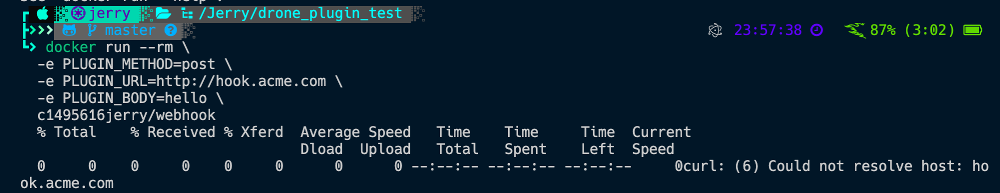

## Deploy to Docker Hub

```
$ docker login
$ docker build -t <username>/webhook .
$ docker push <username>/webhook
```

## Verify

```
$ docker run --rm \
  -e PLUGIN_METHOD=post \
  -e PLUGIN_URL=http://hook.acme.com \
  -e PLUGIN_BODY=hello \
  <username>/webhook
```

